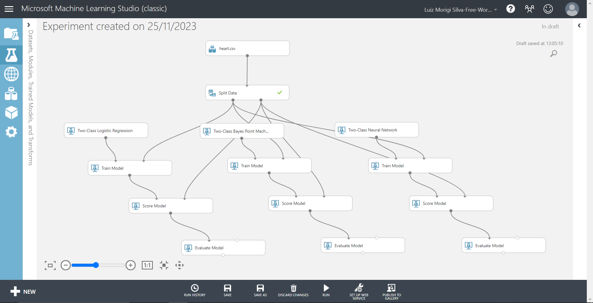

# Processo de Modelagem - Heart Attack Detection

## Introdução
Neste documento, descreveremos o processo de modelagem utilizado no experimento de detecção de ataques cardíacos. Este projeto foi desenvolvido no Microsoft Machine Learning Studio.

## Objetivo
O objetivo principal é criar um modelo de aprendizado de máquina capaz de prever a ocorrência de ataques cardíacos com base em conjuntos de dados específicos.

## Passos do Processo de Modelagem

### 1. Escolha do Algoritmo de Aprendizado de Máquina
- Realizando testes: 

 

### 2. Treinamento do Modelo
- Divisão do conjunto de dados em treinamento e teste.
- Treinamento do modelo com o conjunto de treinamento.

### 3. Avaliação do Desempenho do Modelo
- Métricas utilizadas para avaliação (por exemplo, precisão, recall, F1-score).
- Análise dos resultados obtidos no conjunto de teste.

### 4. Ajuste Fino dos Parâmetros
- Iterações para ajuste fino dos parâmetros.
- Uso de técnicas como validação cruzada, se aplicável.

## Resultados e Conclusões
- Apresentação dos resultados finais do modelo.
- Conclusões sobre a eficácia do modelo na detecção de ataques cardíacos.

## Próximos Passos
- Possíveis melhorias no modelo.
- Sugestões para futuras iterações.

## Referências
- Listagem de fontes utilizadas para aprimorar o processo de modelagem.

Este documento servirá como guia para entender o desenvolvimento do modelo e suas etapas cruciais.
